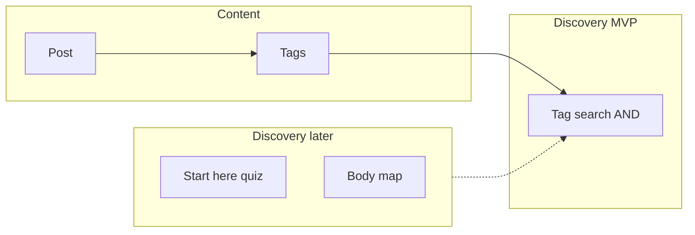

# MVP product plan — prioritet-zdrave

English-first public site (target domain: **prioritet-zdrave.bg**). Responsive on desktop and mobile.

## Long-term vision

The site helps people find practical wellness content: essential oil blends, food recipes (e.g. insulin resistance), exercises (back, IR, etc.), and personal stories. Long term, the same information can be reached in several ways:

- Browse by section or tags
- **Search** (MVP: multi-tag filter)
- **Start here** — questionnaire that infers relevant topics
- Later: body map, chat, category buttons — all feeding the same filtered content

For planning, most formats collapse to one model: **a post** (text + image + metadata) with **tags**.



## MVP scope (product)

### In scope

1. **Posts** (developer-authored at first)
   - Title, slug, date, excerpt, body, cover image
   - **Tags:** free text when creating a post; suggest **already-used** tags (autocomplete)
2. **Post listing** (cards or chronological grid)
3. **Search by tags** (`/search` or `/tags`)
   - List all unique tags (checkboxes / grid, mobile-friendly)
   - Select one or more → **Search** → posts that include **all** selected tags (**AND**; OR is a future option)
4. **English UI** via i18n keys + CSV (Bulgarian column later)
5. **Educational disclaimer** in footer
6. **Phased delivery:** see [visual-phase-1.md](visual-phase-1.md) first, then technical features in [technical-architecture.md](technical-architecture.md)

### Out of scope (later)

- Owner-facing CMS / WYSIWYG
- **Start here** questionnaire logic (nav link + stub OK in visual phase)
- Body map, chat, condition “hub” pages as separate products (same tag engine underneath)
- Separate content types for stories — use tags (e.g. `story`, `inspire`)
- Comments, auth, newsletter, analytics, production deploy (local-first until agreed)
- **Bulgarian UI** — next step after MVP: fill `bg` in CSV + locale routing if needed

### Acceptance criteria

- New post = add Markdown per documented process without code changes (phase 2+)
- Multi-tag search uses **AND** by default
- New tags appear in the aggregated tag list after first use
- `npm run dev` serves the site; core screens work on mobile width
- No hardcoded UI strings (except post body from Markdown)

## Content model

| Field | Purpose |
|-------|---------|
| `title` | Display title |
| `slug` | URL segment |
| `date` | Published date |
| `excerpt` | Card / SEO teaser |
| `body` | Markdown content |
| `cover` | Image path under `public/` |
| `tags` | String array; free-form, autocomplete from existing |

Optional later: `locale` per post or `content/posts/en/` vs `bg/`.

**Nav “Recipes”:** recommend listing posts tagged for food/recipes; all content remains reachable via **Search**.

## Localization

| Layer | MVP | Next step |
|-------|-----|-----------|
| UI (nav, buttons, labels, disclaimer) | English via `t('key')` | Fill `bg` in CSV |
| Post body | English Markdown | Translate posts or split by locale |

**CSV format** (`locales/messages.csv`):

```csv
key,en,bg
brand.name,prioritet-zdrave,
nav.home,Home,
nav.about,About,
nav.recipes,Recipes,
nav.startHere,Start here,
nav.search,Search,
hero.slogan,Prioritize your health, one simple step at a time.,
footer.disclaimer,For education only. Not medical advice.,
```

- Keys use dot notation; `bg` empty until translation pass
- MVP locale: `en` only; structure ready for `/bg` or switcher later

## Owner-authored content (phase after MVP)

**Do not build CMS in MVP.** **Do** use a **content seam** from day one:

- `listPosts()`, `getPostBySlug()`, `listAllTags()`, `filterPostsByTags()`
- Pages never read the filesystem directly
- Swap Markdown → headless CMS without changing URLs or search behavior

## Design reference

- Mood: calm, natural, “health at home”
- Layout inspiration: [Pinch of Yum](https://pinchofyum.com/) — details in [visual-phase-1.md](visual-phase-1.md)
- Placeholder images: files in `public/images/` (Unsplash/Pexels manual download); no image API required for MVP

## Implementation phases

| Phase | Deliverable | Doc |
|-------|-------------|-----|
| 0 | Git + docs | [repo-setup.md](repo-setup.md) |
| 1 | Visual homepage + shell | [visual-phase-1.md](visual-phase-1.md) |
| 2 | Posts, search, i18n wired | [technical-architecture.md](technical-architecture.md) |
| 3 | Deploy, `prioritet-zdrave.bg`, Bulgarian | TBD |

## Open decisions

- Primary **hero headline** (slogan chosen; headline TBD — see visual doc)
- Tag search **AND** vs **OR** for multiple tags (default **AND**)
- Circle row: health **topics** vs daily **routines** (see visual doc)

## Decisions log

| Topic | Decision |
|-------|----------|
| Site language (MVP) | English UI + English posts |
| i18n | CSV `key,en,bg` |
| Hero pillars | Essential oils, Recipes, Exercises, Inspire |
| Hero slogan | Prioritize your health, one simple step at a time. |
| Brand | prioritet-zdrave (header) |
| Nav | Home, About, Recipes, Start here, Search |
| Build order | Visual first, then technical MVP |
