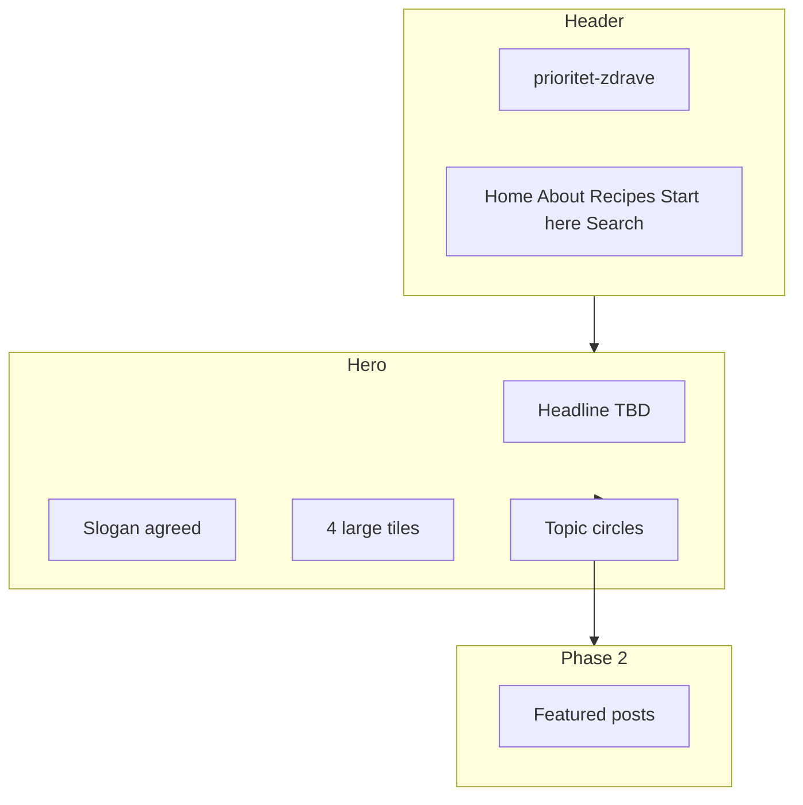

# Visual phase 1 — homepage and shell

**Goal:** Implement look-and-feel before post/search backend. Reference: [Pinch of Yum](https://pinchofyum.com/) homepage hero and category entry pattern — adapted for wellness, not a copy.

**Phase 1 includes:** responsive layout, header/footer, hero, four large tiles, circle row, placeholder imagery, i18n keys for all UI copy (English).

**Phase 1 excludes:** Markdown loading, real tag filtering, questionnaire logic, CMS.

---

## Global header

| Element | Spec |
|---------|------|
| Wordmark (left) | `prioritet-zdrave` — styled text logo |
| Nav links | **Home** · **About** · **Recipes** · **Start here** · **Search** |
| Start here | Links to `/start-here` — placeholder or “Coming soon” until quiz exists |
| Search | Links to `/search` — stub in phase 1; full tag UI in phase 2 |

### i18n keys

`brand.name`, `nav.home`, `nav.about`, `nav.recipes`, `nav.startHere`, `nav.search`

---

## Hero block (Pinch of Yum pattern)

Structure top to bottom:

1. **Primary headline** (large, friendly — one line or two)
2. **Supporting slogan** (smaller, under headline)
3. **Four large image tiles** (2×2 desktop; stack or 2×2 on mobile)
4. **Row of smaller circles** (topic quick links)
5. *(Phase 2)* Featured post cards below the fold

### Copy

| Layer | Status | Text |
|-------|--------|------|
| Slogan | **Agreed** | Prioritize your health, one simple step at a time. |
| Headline | **TBD** | Pick one or write custom |

**Headline candidates:**

1. Simple wellness for real, everyday life.
2. Oils, food, movement, and ideas that fit your everyday.
3. Health-first habits you can actually keep.

i18n: `hero.title`, `hero.slogan`

---

## Four large hero tiles

Replace POY’s four recipe photos. Each tile: full-bleed or card image, label overlay or below, optional subtitle, entire card clickable.

| # | Label | Phase 2 link target | Notes |
|---|--------|---------------------|--------|
| 1 | Essential oils | Tag `essential-oils` (or filter preset) | Oils / blends |
| 2 | Recipes | Food posts / tag `recipes` | Aligns with nav **Recipes** |
| 3 | Exercises | Tag `exercises` or `movement` | Movement / rehab |
| 4 | Inspire | Tag `inspire` or featured mix | Stories, articles, motivation |

**Rejected for hero:** “Stories/Blogs” — redundant on a post-based site; **Inspire** is the reading/emotional entry.

Optional subtitles (TBD), e.g.:

- Essential oils — *Calm, focus, everyday support*
- Recipes — *Nourishing meals for real life*
- Exercises — *Gentle movement that fits your day*
- Inspire — *Stories and ideas that help*

i18n: `hero.tile.oils`, `hero.tile.recipes`, `hero.tile.exercises`, `hero.tile.inspire` (+ optional `.subtitle`)

Phase 1: use placeholder photos (wellness, food, movement, people/lifestyle); href `#` or stub routes.

---

## Smaller circles (quick browse)

On POY: seasonal label + round category chips. Here: **health topics / concerns** that map to tags later (not duplicates of the four tiles).

### Recommended set (8)

| Circle | Intent |
|--------|--------|
| Insulin balance | IR-related content |
| Sleep | Cross-pillar |
| Stress & calm | Cross-pillar |
| Back & mobility | Exercises + support |
| Energy | General wellness |
| Gut-friendly | Recipe-heavy |
| Start small | Beginner / `beginner` tag |
| Popular | Editor’s picks (static in phase 1) |

### Alternative set (routines)

Morning routine · Evening wind-down · Meal prep · Desk breaks · Seasonal wellness

**Open:** confirm topics vs routines (or hybrid: first row topics, second row routines later).

Phase 1: visual only; links to `/search` stub with query params reserved for phase 2.

i18n: `topic.insulinBalance`, `topic.sleep`, … (one key per circle)

---

## Footer

- Disclaimer: education only, not medical advice (`footer.disclaimer`)
- Optional: `prioritet-zdrave.bg` when domain is live

---

## Design tokens (draft)

| Token | Direction |
|-------|-----------|
| Mood | Calm, natural, approachable — not clinical, not luxury spa |
| Color | Warm white background; sage / soft green accents; cream; restrained terracotta optional |
| Space | Generous whitespace like POY |
| Type | Serif or soft serif for headlines; clean sans for body and nav |
| Imagery | Bright, natural light; real-life feel; consistent aspect ratio on cards |

Finalize fonts and exact hex values during implementation.

---

## Page map (phase 1 stubs)

| Route | Phase 1 |
|-------|---------|
| `/` | Full hero + tiles + circles |
| `/about` | Simple placeholder page |
| `/recipes` | Placeholder or static “coming in phase 2” |
| `/start-here` | Placeholder for questionnaire |
| `/search` | Placeholder layout hinting at tag checkboxes |

---

## Layout diagram

---

## Open items (refine in discussion)

- [ ] Final primary headline
- [ ] Circle labels: topics vs routines
- [ ] Tile subtitles (yes/no and exact copy)
- [ ] Recipes nav: only food-tagged posts vs all posts (**recommend:** food-tagged only)
